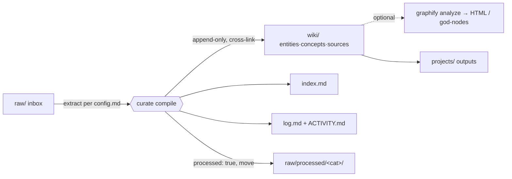
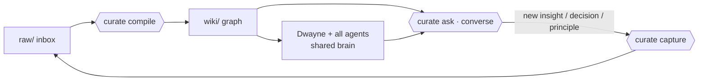

# Knowledge Curator Wiki — Design Spec

## 1. Goal & purpose

A **living, conversational, shared knowledge graph** for Dwayne and the whole agent fleet. It must:

1. **Share information** — one canonical brain that every agent (Claude Code, Codex, Cursor, Kimi, Goose, Hermes, Antigravity, Kiro) and Dwayne read from.
2. **Be conversational** — you can *ask the wiki questions* and get cited, multi-turn answers, not just store files.
3. **Learn from conversations** — genuinely new insights from those conversations get captured back in and compounded, so the *mindset* the wiki encodes keeps growing.
4. **Build best practice** — decisions, SOPs, and reusable principles are distilled into first-class, queryable pages.

This vault implements Andrej Karpathy's **LLM-Wiki pattern** (structured, wikilinked markdown instead of vector embeddings). The agent is the maintainer; the human curates sources and asks questions. Canonical copy lives on the VPS (`/home/ubuntu/wiki`), git-synced to `github.com/dman1313/agent-memory-coding`.

## 2. Locked decisions

| Decision | Choice |
|---|---|
| Deliverable | Full runnable agent system (skill + governance + scaffold) |
| Vault location | Existing iCloud **Agent Memory/Coding** vault |
| Build approach | **A** — one `curate` skill + governance, manual trigger, upgradable to auto-ingestion later |
| Data types | SOPs, transcripts/meetings, docs/code/GitHub, articles/media, notes & agent logs, + stock/trade ideas (primary, per vault-purpose) |
| PII filter | **None** — curator only flags obvious secrets (API keys, passwords) it happens to see |
| Visual tooling | Mermaid + Obsidian Bases + Canvas + Dataview (all) |
| Agent embodiment | **Hybrid** — one skill with modes |
| Engine | The **agent itself**, governed by `AGENTS.md` + `config.md` (graphify is an optional viz lens, not the curator) |

## 3. Current state & findings to fix

The skeleton already exists (`raw/`, `raw/processed/<cat>/`, `wiki/{entities,concepts,sources,schema}`, `index.md`, `log.md`, `schema/AGENTS.md`, a fleet `Agents/` layer). What's missing/broken:

| # | Finding | Fix |
|---|---|---|
| 1 | Imported `compile-raw` skill targets the wrong taxonomy (`people/companies/topics` + `raw/meetings/…`) | Do **not** adopt it. Ingest the two backlog raw files as `sources/`; the new `curate` skill supersedes it. No `people/`/`companies/` folders created. |
| 2 | Schema lives in 3 places with no precedence | Define explicit layers (§7). |
| 3 | SOPs, best-practices, and stock/trade ideas have no home in the 3-type ontology | Add `sop` + `principle` concept subtypes; document the stock-idea flow (§6). |
| 4 | Vault is git→VPS synced & fleet-shared | Skill is committed to the repo; read/consult contract added for all agents (§10). |

## 4. Architecture

Four layers, one direction of flow, closed by a learning loop.



The compounding loop (the heart of the goal):



## 5. The `curate` skill

- **Location:** `.claude/skills/curate/SKILL.md` inside the vault repo (version-controlled, syncs to VPS, discovered by Claude Code when working in the vault). Optional symlink to `~/.claude/skills/curate` for global availability. Ensure the path is **not** gitignored.
- **Single source of truth:** the skill body is thin and **defers to** `schema/AGENTS.md` (process), `wiki/schema/config.md` (page format), and `schema/curate-modes.md` (mode specs). No rules duplicated in the skill.

| Mode | Role |
|---|---|
| `compile` (default) | Find unprocessed `raw/` files (oldest first); extract per `config.md`; create/append wiki pages (dated headings, **append-only**); cross-link aggressively; pull **decisions, SOPs, and reusable principles** into the right subtypes; update `index.md`; log to `wiki/log.md` + `ACTIVITY.md`; mark `processed: true` (+ `processed_at`, `wiki_articles_touched`) and move to `raw/processed/<cat>/`. **>10 files → ask first** (token guard). |
| `ask "<q>"` | Converse with the wiki: read `index.md` → select relevant pages → follow `[[wikilinks]]` → answer **with `[[page]]` citations**, multi-turn. `--deep` routes to `graphify query` for multi-hop traversal — this requires a prior `analyze` run (graphify's `graph.json`); without it, `--deep` falls back to standard link-following. |
| `capture` | Distill a conversation's genuinely-new insights into a `raw/` note (unprocessed) for the next `compile`. Integrates with the existing **`wrapup`** skill. Selective: insight/decision/principle, not chatter. |
| `scribe` | Transcript/meeting-tuned `compile` (participants, decisions, action items, verbatim quotes). |
| `lint` | Health check: orphans, stale (>90d), unprocessed raw, index drift, dead links, merge/best-practice-consolidation candidates → `wiki/log.md` + `ACTIVITY.md`. |
| `analyze` (optional) | Run graphify over `wiki/` for god-nodes / community detection / HTML viz. A lens, not the curator. |

## 6. Taxonomy

Keep `entities/ concepts/ sources/`. Extend **concept** subtypes only:

- Entities (`tags`): person, organization, project, product, event, location, other
- Concepts (`tags`): theory, method, technology, term, **sop**, **principle**, other
- Sources: document, conversation, note

**`sop`** = procedures / how-we-do-things. **`principle`** = mental models / best practices / "how we think." Best-practice pages are `principle`-tagged concepts that grow append-only (showing the *arc* of the thinking = "growing the mindset") and are surfaced by `ask`.

**Stock/trade-idea flow (worked example):**
- Company/ticker → `entities/<company>.md` (`organization`/`product`)
- Thesis or strategy → `concepts/<thesis>.md` (`method`/`theory`/`principle`)
- Research (article, earnings transcript) → `sources/<source>.md`
- A dated trade setup → append-only section on the company's entity page: `## Trade idea 2026-06-05 from [[sources/...]]`

**SOPs become numerous?** Promote `sop` to a top-level `wiki/sops/` later. Not now (YAGNI).

## 7. Schema layers & precedence

| Layer | File | Authoritative for |
|---|---|---|
| Process & lifecycle | `schema/AGENTS.md` | **How to operate** — read order, raw lifecycle, linking, lint, consult/capture contract. Read-only; changes are human-approved. |
| Page-format contract | `wiki/schema/config.md` | **What a page looks like** — frontmatter, templates, subtypes, merge rules, thresholds. |
| Mode specs | `schema/curate-modes.md` *(new)* | The six modes in §5. |
| Derived docs | `wiki/concepts/Wiki-*.md` | Articles *about* the schema — auto-generated, **not** authoritative. |

A short "Schema precedence" block and a "Consulting the wiki" section will be added to `AGENTS.md`. `config.md` subtype list updated to add `sop` + `principle`.

## 8. Final folder layout

```
Coding/                       (vault root = git repo → VPS /home/ubuntu/wiki)
├── schema/
│   ├── AGENTS.md             # process governance (+ precedence + consult contract)
│   ├── curate-modes.md       # NEW — mode specs
│   └── specs/                # NEW — design specs (this file)
├── raw/                      # flat inbox
│   └── processed/<cat>/      # articles assets docs github meetings podcasts twitter youtube
├── wiki/
│   ├── index.md  log.md
│   ├── entities/  concepts/  sources/
│   ├── schema/               # config.md (+ sop, principle), suggestions.md
│   └── _views/               # NEW — Dataview dashboards · .base · master Canvas
├── projects/                 # outputs that reference wiki/
├── Agents/ …                 # existing fleet (unchanged)
└── .claude/skills/curate/SKILL.md   # NEW — the skill (committed)
```

## 9. Visual & dual-coding layer

- **Mermaid** — in-page process/timeline/relationship diagrams; `compile` auto-adds a relationship snippet to pages with ≥3 links.
- **Dataview** (`wiki/_views/`) — dashboards: Recently Updated, Orphans, Stale (>90d), Unprocessed raw, counts by type. *(Requires the Dataview plugin.)*
- **Obsidian Base** (`wiki/_views/*.base`) — browsable tables over frontmatter (entities by tag, concepts by subtype). Replaces the stray `Untitled.base`.
- **Canvas** (`wiki/_views/knowledge-map.canvas`) — curated master relationship map; optionally regenerated from `curate analyze`.

## 10. Conversation, learning loop & shared-brain contract

- **Conversation** is first-class via `ask` (§5): cited, multi-turn, structure-driven (no embeddings guesswork — the links say what's related).
- **Learning loop:** `ask` → new insight → `capture` writes a `raw/` note → next `compile` folds it in append-only. The wiki and its mindset compound.
- **Shared-brain contract** (added to `AGENTS.md`): *before answering a substantive question in the vault's domains, any agent reads `wiki/index.md` + relevant pages and cites them; at session end, consider `capture`.* Agents reach the brain via `ask` + this contract; Dwayne reaches it via Obsidian (`_views`, graph, Base) **and** `ask`. Aligns with existing `AGENT-BOOTSTRAP.md` / `STANDING-ORDERS.md` startup ritual.

### `capture` selectivity rule
Capture **only**: a decision (with date/decider/rationale), a reusable principle/best-practice, a new entity/relationship not yet in the graph, or a correction/contradiction of an existing page. **Skip**: restating existing pages, transient chatter, unverified speculation (mark `> Uncertain:` if borderline). When in doubt, capture as a `sources/` note tagged `conversation` rather than asserting it as fact.

## 11. Execution, sync, governance & safety

- **Trigger:** manual (`/curate compile|ask|capture|scribe|lint|analyze`). Upgrade path to Approach **B** (VPS watcher / git-hook auto-compile) once the manual flow is proven (~6-week forcing function, per the company-brain playbook).
- **Read order (enforced):** `AGENTS.md → index.md → log.md → targets`.
- **Sync:** commit after each run (raw moved + wiki + log); hook into existing `sync.sh`. Implementation follows `STANDING-ORDERS.md` and logs to `ACTIVITY.md`. Pushing to GitHub/VPS is a separate, human-authorized step.
- **Governance:** `schema/AGENTS.md` is read-only to agents; schema changes are human-approved. Dwayne has authorized the changes in this spec.
- **Safety boundaries (baked in):**
  - No PII scrubbing — flag obvious secrets only.
  - Raw files immutable — only the `processed` frontmatter changes; never deleted.
  - Append-only wiki — never overwrite history; contradictions preserved with attribution.
  - The curator **organizes** Dwayne's trade/stock research and links it — it does **not** generate trade or investment recommendations.

## 12. Build steps (implementation preview)

1. **Schema consolidation** — add "precedence" + "Consulting the wiki" sections to `AGENTS.md`; add `sop` + `principle` to `config.md`; create `schema/curate-modes.md`.
2. **Build the `curate` skill** — `.claude/skills/curate/SKILL.md` with the six modes, deferring to schema.
3. **Clear the backlog** — `compile` the two unprocessed raw files (Jeff explainer + skill) into `sources/`; confirm the imported skill is superseded (not its taxonomy).
4. **Views** — create `wiki/_views/` Dataview dashboards, an entities `.base`, and a master Canvas.
5. **Examples** — add the stock-idea and SOP/principle worked patterns to the templates/`config.md`.
6. **Verify** — dry-run `lint`, then `compile`; confirm pages, links, index, log; commit. (Push only on Dwayne's go-ahead.)

## 13. Future (not in this build)

- Approach **B** auto-ingestion (VPS watcher/git-hook).
- Source connectors (drop-folder, email→raw, clippings via kimi-webbridge).
- Promote `sop` to `wiki/sops/` if volume warrants.
- NotebookLM push of distilled best-practice pages (via existing `notebooklm`/`wrapup`).
