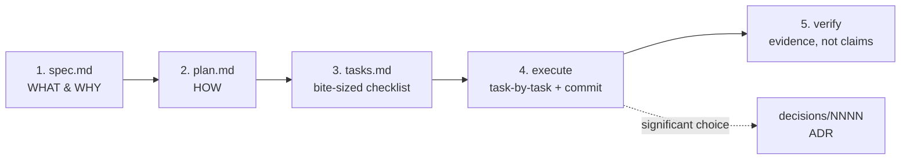

# Spec-Driven Development (SDD) — Fleet Protocol

Every agent follows this before building anything non-trivial.
**Spec before code. Plan before tasks. Verify before "done."**

This is how the [[Knowledge Curator]] wiki was built — it works, so the whole fleet uses it.

## Why

Without a shared spec, agents start coding from different assumptions, duplicate each other, and produce work that has to be redone. A spec + plan written down once is reviewable, hand-off-able, and stops the fleet from diverging.

## When to use it

| Use SDD for | Skip SDD for |
|---|---|
| New features, multi-file changes | Typos, one-line fixes |
| Anything architectural | Config tweaks |
| Work another agent might touch | Pure exploration / reading |
| Anything > ~30 min | Trivial chores |

Use judgment. The spec can be short for a small feature — but write one.

## The flow



## Folder structure

```
sdd/
├── README.md            ← this protocol
├── templates/           ← copy these to start a new spec
│   ├── spec.md  plan.md  tasks.md  decision.md
├── specs/
│   └── YYYY-MM-DD-<slug>/    ← ONE folder per feature
│       ├── spec.md   ← the WHAT & WHY
│       ├── plan.md   ← the HOW
│       └── tasks.md  ← bite-sized checklist
└── decisions/
    └── NNNN-<slug>.md  ← Architecture Decision Records (cross-cutting choices)
```

## How to run a spec (step by step)

1. **Make the feature folder:** `sdd/specs/YYYY-MM-DD-<slug>/`, and copy the three files from `sdd/templates/` into it.
2. **Write `spec.md`** — clarify intent first; if anything is ambiguous, *ask Dwayne before planning*. Fill Goal, Requirements, Success criteria, Out of scope. Get a 👍 before moving on.
3. **Write `plan.md`** — approach, architecture, the file-by-file change list, and how you'll verify.
4. **Write `tasks.md`** — break the plan into bite-sized steps. Each task names its files, the action, how to verify, and the commit.
5. **Execute** task-by-task. Tick `- [x]`, commit per task, and **verify with evidence** (run it / show output) — never claim success you haven't seen.
6. **Record decisions** — any significant or hard-to-reverse choice becomes an ADR in `sdd/decisions/`.
7. **Close** — mark the spec `Done`, log a `milestone` to `ACTIVITY.md`, and link any new knowledge into `wiki/`.

## Rules

- **Spec before code.** No "I'll just start."
- **One feature = one dated spec folder.** Don't mix features.
- **Append-only.** Don't delete history; add dated notes under the existing content.
- **No placeholders in plans.** "TBD" / "handle errors" / "write tests" without the actual content is a failure — write the real thing.
- **Verify before "done."** Show the command and its output.
- **Stay linked.** Reference `wiki/` pages from specs, and log to `ACTIVITY.md` so the fleet sees the work.
- **Naming:** folders/files `lowercase-with-hyphens`; spec folders dated `YYYY-MM-DD-<slug>`; ADRs numbered `NNNN-<slug>.md`.

## Worked example

The vault's own Knowledge Curator was built with this exact flow — see
`schema/specs/2026-06-05-knowledge-curator-design.md` (spec) and
`schema/specs/2026-06-05-knowledge-curator-implementation-plan.md` (plan)
for a complete, real example to copy the shape from.
