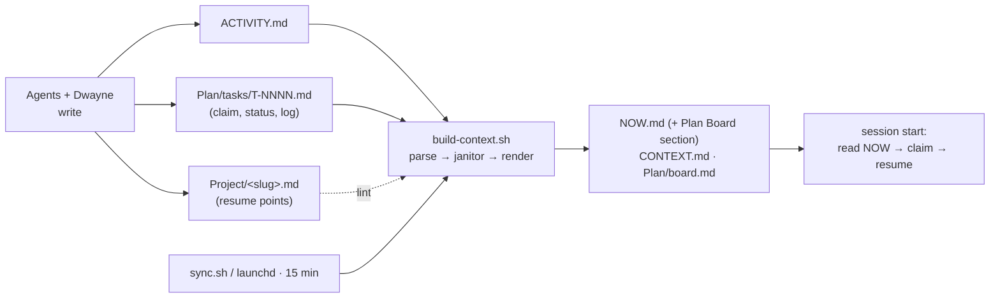

# Plan: Fleet Plan Board & Self-Maintaining Coordination

> Spec: ./spec.md · **Status:** Approved

## Approach

Extend the machinery that already exists — `build-context.sh` (generator), `sync.sh` (15-min cadence on Mac launchd), and the vault's markdown conventions — rather than adding any service or daemon. Three workstreams: **(A)** board + resume-point content (pure markdown), **(B)** generator + janitor (bash, all inside `build-context.sh`), **(C)** rules/docs updates.

Options considered: a separate `janitor.sh` vs extending `build-context.sh` → **extend** (sync.sh already invokes it every cycle; one entry point, one cadence). Single `PLAN.md` task list vs one-file-per-task → **per-task files** (single-writer = no merge conflicts; matches "one file per topic"). hyperagent implements everything that is file-content; on-machine verification (launchd health) is seeded to MacH as a board task.

## Architecture



Key design points:

- **Task file frontmatter** (exact):
  ```yaml
  ---
  id: T-0001
  title: Short imperative title
  project: project-slug          # same slug as ACTIVITY + Project/<slug>.md
  status: todo                   # todo|claimed|doing|blocked|review|done|dropped
  owner:                         # agent name once claimed
  created_by: dwayne|agent-name
  created: 2026-06-11T13:00:00Z
  updated: 2026-06-11T13:00:00Z
  priority: P2                   # P1|P2|P3
  depends_on: []                 # [T-0000, ...]
  handoff_to:                    # agent name when handing off
  ---
  ## Brief
  ## Log
  ```
- **Janitor ordering inside build-context.sh:** parse ACTIVITY → detect stale sessions (existing STALEFILE logic) → if any: append synthetic `session-end | (auto-closed by janitor: open since <ts>, no session-end >48h)` lines below the marker, then re-parse **once** (guard flag, no loop). Auto-close is reversible by simply logging a new `session-start`.
- **Channel archiver:** operates only on blocks anchored at `^### To\[` ending at the next anchor/EOF. A block moves to `channel-archive/YYYY-MM.md` only if `**Status:** DONE` *and* header date ≤ now−48h. Non-message prose (the how-it-works header) is untouched; one-time restructure in T5 moves that header to the top and adds a `<!-- MESSAGES BELOW THIS LINE -->` marker. Archive appends verbatim — nothing is ever deleted.
- **Board renderer:** awk extracts frontmatter between `---` fences from `Plan/tasks/*.md` → TSV → renders `Plan/board.md` (groups: Doing/Claimed by agent · Blocked (with depends_on) · Todo by priority · Review · Done last 7d) and a compact **Plan Board** section near the top of NOW.md (counts + doing/claimed lines + top 5 todos).
- **Lints rendered into NOW.md:** duplicate task ids · missing required frontmatter · task claimed by an agent with no ACTIVITY entry in 7d · project with open tasks whose `Project/<slug>.md` lacks `## Status now` (resume page missing/stale v1).
- **Inbox aging:** existing Pending Inboxes section gains `⚠ pending >7d` suffix when the newest PENDING dispatch timestamp is older than 7 days.
- **Fleet list fix:** `FLEET_AGENTS` gains `hyperagent`; the embedded ACTIVITY header template's agent list gains `MacH, antigravity, hyperagent` (current drift).
- **VPS cron** (per AGENT-SETUP) does pull/commit/push only — it never runs build-context.sh. Leave as-is: the Mac launchd cycle regenerates within 15 min and pushes. Risk noted below.

## File structure

| File | Create / Modify | Responsibility |
|---|---|---|
| `Plan/README.md` | Create | Board contract: lifecycle, claim protocol, single-writer rule, handoffs, id scheme |
| `Plan/tasks/T-0001…T-0006-*.md` | Create | Seeded launch tasks (see tasks.md T2) |
| `Plan/board.md` | Generated | Dashboard — script-only, never hand-edited |
| `build-context.sh` | Modify | FLEET_AGENTS + header fix; `render_plan_board()`; `auto_close_stale_sessions()`; `archive_channel()`; inbox aging; lints; NOW.md Plan Board section |
| `AGENT-CHANNEL.md` | Modify | Header moved to top + `<!-- MESSAGES BELOW THIS LINE -->` marker + S3 roles paragraph |
| `channel-archive/2026-06.md` | Generated | First archive month (created by archiver) |
| `Project/vault-purpose.md` | Modify | Dual-purpose rewrite (S1) |
| `Project/<active>.md` | Modify | Resume sections (`## Status now / Next steps / Where things live / Open tasks`) added to projects touched by seeds |
| `AGENT-SETUP.md` | Modify | "For cloud / API-only agents" section (M5) + agent-name drift fix (S1) |
| `AGENT-BOOTSTRAP.md` | Modify | Ritual additions: board check/claim · resume read/update · research-once (M7/M8) |
| `STANDING-ORDERS.md` | Modify | Short "Plan Board & Resume Points" section linking Plan/README.md |
| `CLAUDE.md` | Modify | Knowledge-routing row: `Fleet plan board | Plan/` |
| `sdd/decisions/0004-fleet-plan-board.md` | Create | ADR: board + resume points + research-once adopted |
| `DECISIONS.md` | Modify | Chronological entry pointing at ADR 0004 |
| `ACTIVITY.md` | Modify | Progress entries per task (append-only, below marker) |

## Verification strategy

- **Sandbox replica:** hyperagent mirrors the repo to `/home/ubuntu/agent-memory` in its sandbox — the script's VPS auto-detect path — so every `build-context.sh` change runs against real vault data before commit. `bash -n` syntax check + full run + diff of NOW.md/board.md per task.
- **Fixtures:** synthetic stale session (>48h), DONE channel block (>48h), duplicate task id, claimed-by-silent-agent task — each must trigger exactly its lint/janitor action in a sandbox run; output pasted into tasks.md as evidence.
- **Regression guard:** NOW.md generated from unmodified ACTIVITY data must keep all existing sections (spec criterion 7); diff reviewed before the build-context.sh commit.
- **On-machine:** seeded task T-0002 (MacH) verifies the launchd vault-sync job is actually running — NOW.md was ~15h stale at planning time, so the 15-min cadence is suspect. Janitor only helps if the script runs.
- **End-to-end:** after launch commit, one seeded task is claimed and moved by a second agent (spec criterion 1); resume test on a real project page (criterion 2).

## Risks / unknowns

- **launchd job down (suspected):** NOW.md stale ~15h despite sync.sh design. Mitigation: T-0002 seeded to MacH; until fixed, hyperagent can regenerate board/NOW in-sandbox and commit via API on request.
- **Channel parser corrupting prose:** block-anchored regex only; one-time restructure done by hand (T5), archiver tested on fixtures + dry-run diff before commit; archive is append-only so worst case is a message in two places, never lost.
- **Auto-close false positive** (agent genuinely mid-task >48h silent): synthetic session-end is informational, not destructive; agent re-opens with a new session-start. Standing orders already require logging during work, so >48h silence is itself a protocol breach worth surfacing.
- **Bash portability:** reuse the script's existing `date -v` / `date -d` dual pattern for all new date math; no GNU-only flags.
- **API-commit races vs 15-min sync:** hyperagent always fetches fresh file state immediately before composing a commit and uses fast-forward-only ref updates; on conflict, re-fetch and retry.
- **Adoption risk** (agents ignore the board): bootstrap ritual + NOW.md placement put the board in the existing read path; seeded real tasks give it day-one utility; janitor lints make neglect visible in NOW.md.
