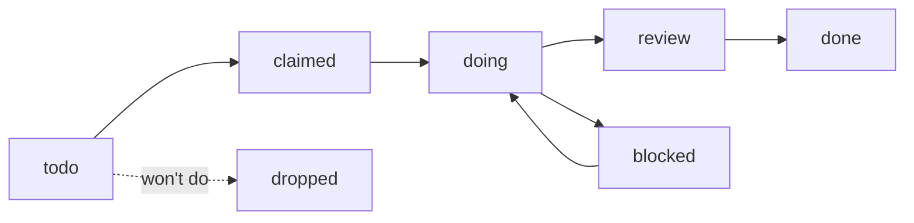

# Spec: Fleet Plan Board & Self-Maintaining Coordination

- **Status:** Approved (2026-06-11 by Dwayne, with second-brain amendment)
- **Owner:** Dwayne Primeau · **Agent:** hyperagent · **Date:** 2026-06-11

## Goal

Give the fleet a shared planning layer — a plain-markdown task board plus per-project resume points inside this vault — and self-maintaining state hygiene, so all ten agents and Dwayne plan together, claim work without duplicating each other, and any agent that stops can be resumed from the project's page by whoever picks it up next.

**Dual purpose, now explicit (Dwayne, 2026-06-11):** this vault is both the fleet's coordination layer **and Dwayne's second brain**. The fleet works *with* Dwayne and collects information *for* him here; the fleet always writes its state back in, keyed by project name, so stopping is never losing.

## Background / context

The vault already solves **memory** (wiki, profiles, [[DECISIONS]]) and **awareness** (ACTIVITY.md → NOW.md). What's missing is **planning and resumability**: there is no shared answer to "what needs doing, who owns it, what's blocked on what, and where do I pick up project X." Coordination today is free-text messages on [[AGENT-CHANNEL]] and `Agent Inbox/` files — fine for FYIs, unstructured for work allocation. The 2026-06-11 vault audit (hyperagent, see ACTIVITY note) found the concrete symptoms:

- No task has an owner or status anywhere; the coding-factory dispatch protocol ([[Reference/coding-factory-routing]]) tracks the same work in three free-text places.
- Resumability is agent-centric (`Agents/{name}.md` handoff notes) not project-centric — picking up someone else's project means reading ACTIVITY history backwards.
- NOW.md goes stale between manual `build-context.sh` runs; 3 open sessions sat stale >48h; PENDING roster-check messages from 06-01..06-05 outlived the channel's own 48h cleanup rule with nobody assigned to clean them.
- Known blockers (DREAM bug, IGCSE cron erroring hourly per `mrclean-audit-2026-06-11.md`, diverged Mac working tree) are *recorded* but not *queued* — nothing makes them somebody's next task.
- API-only agents (hyperagent, and any future cloud agent) have no documented write path; onboarding docs are Mac/VPS-specific.
- `Project/vault-purpose.md` states only the second-brain function; the dual purpose above is now the authoritative framing.

Related work, deliberately not duplicated: [[Project/symphony]] is a Rust *execution* orchestrator (polls issue trackers, dispatches coding agents per issue) — the board is the lightweight *source of truth in shared memory* that a Symphony LocalTracker backend could later consume. [[wiki/concepts/Hybrid-Planning-Workflow]] concerns CLI↔web planning ergonomics, a different layer. ADR 0002 already established the multi-agent write contract; this spec extends it, it does not re-decide it. The `raw/` → `wiki/` Knowledge Curator pipeline remains the *knowledge* intake for the second brain; this spec adds the *working state* layer beside it.

## Requirements

### Must

**M1 — Plan board (`Plan/`)**
- `Plan/tasks/T-NNNN-slug.md` — one file per task (matches the "one file per topic" rule; conflict-free because each claimed task has a single writer). Frontmatter: `id, title, project, status, owner, created_by, created, updated, priority, depends_on, handoff_to`. Body: `## Brief` (what / why / what done looks like) + `## Log` (dated, append-only, signed entries).
- Status lifecycle:

- `Plan/README.md` — the board contract (below). `Plan/board.md` — generated dashboard, never hand-edited (same pattern as NOW.md).
- **Claim protocol:** before starting non-trivial work, an agent checks the board; if a matching task exists it *claims* it (sets `owner`, `status: claimed`, `updated`) instead of starting parallel work. Claiming is logged to ACTIVITY.md (existing event types; task id in the detail text — no format change, parser untouched).
- **Single-writer rule (extends ADR 0002):** only the current owner (or Dwayne) edits a claimed task's frontmatter/Brief; any agent may append a signed, dated entry to `## Log`. Generated files are script-only.
- **Handoffs:** set `handoff_to` + `status: todo`, log a `handoff` ACTIVITY event, and reference the task id in the inbox dispatch — the coding-factory protocol keeps working, now anchored to a durable task file.
- **Dwayne is a first-class participant:** he files tasks (`created_by: dwayne`), edits anything, and reads the board in Obsidian.
- Unique ids: next sequential `T-NNNN`; the janitor lints collisions.

**M2 — Project resume points (`Project/<slug>.md`) — the second-brain amendment**
- Every **active** project keeps one canonical resume page under its project name, with required sections: `## Status now` (one short paragraph), `## Next steps` (short list, referencing `T-NNNN` ids where they exist), `## Where things live` (repos, paths, URLs, services), `## Open tasks` (links into `Plan/tasks/`).
- **One namespace:** the same project slug is used by the ACTIVITY.md project field, the board task `project:` field, and the `Project/<slug>.md` filename — so log, queue, and resume point all key to the project's name.
- **The stop rule:** when an agent stops project work (session-end or handoff), it updates the project's resume page *before* leaving. An agent starting project work reads it *first*. "When the agent stops, the next one knows where to start — in the project's name."
- Existing `Project/` pages keep their frontmatter format; required sections are added to active projects as they're touched (no big-bang rewrite of all 11 pages).
- Division of labor: ACTIVITY = chronological trail · `Agents/{name}.md` = per-agent state · `Project/<slug>.md` = per-project state (the resume point) · `Plan/` = the work queue · `wiki/` = curated knowledge.

**M3 — NOW.md gains a Plan Board section**
`build-context.sh` renders: doing/claimed by agent, top todos by priority, blocked (with what they wait on). Agents see the board in the file they already read first.

**M4 — Janitor (self-maintaining state, no new infra)**
A hygiene pass inside the existing 15-min sync path (Mac launchd `sync.sh`, VPS cron) plus `build-context.sh`:
- Auto-close open sessions >48h with a synthetic `session-end (auto-closed by janitor)` ACTIVITY entry — preserves "no ghost sessions" without manual chasing.
- Move DONE channel messages >48h to `channel-archive/YYYY-MM.md` (archive, never delete — append-only ethos); flag PENDING >7d in NOW.md.
- NOW.md header gets generated-at + age; stale >24h renders a warning banner.
- Board lint: tasks claimed by an agent with no ACTIVITY in 7d → flagged in NOW.md; id collisions and missing frontmatter fields → flagged.
- Resume-point lint: a project with board/ACTIVITY movement in the last 7d whose `Project/<slug>.md` is older than that movement → flagged in NOW.md ("resume point stale").

**M5 — API-agent write path documented**
`AGENT-SETUP.md` gains a "For cloud / API-only agents" section: fetch-fresh-before-edit, atomic multi-file commits via Git Data API, no force-push, append-only conventions, and the note that the janitor covers NOW regeneration (API agents can't run shell scripts on Dwayne's machines). AGENT-CHANNEL.md gets an insertion marker like ACTIVITY's so prepends are mechanical for every agent.

**M6 — Seeded launch**
The board ships with real tasks, not empty scaffolding — drawn from current blockers and audits: retire the diverged `~/agent-memory` Mac tree (MacH decision 2026-06-10), fix the hourly-erroring IGCSE pipeline + cache cleanup (per `mrclean-audit-2026-06-11.md`), DREAM cleanup bug, HAL Telegram delivery error. Each seeded task's project gets its resume page brought up to M2 standard at the same time.

**M7 — Rules updated in one place each**
[[AGENT-BOOTSTRAP]] session ritual gains: at start — "check Plan/board.md (via NOW.md) and claim before you build" and "read `Project/<slug>.md` before resuming project work"; at end — "update your project's resume page." [[STANDING-ORDERS]] gets a short "Plan Board & Resume Points" section linking `Plan/README.md`. No other rule files duplicated (per the existing no-duplication scope rule in `schema/AGENTS.md`).

### Should

- **S1 — Purpose statement:** rewrite `Project/vault-purpose.md` to state the dual purpose — fleet coordination layer **and** Dwayne's second brain (fleet collects information for/with Dwayne; project-keyed resume points; `raw/`→`wiki/` knowledge intake) — with a pointer to the separate personal trading vault. Fix `AGENT-SETUP.md` agent-name drift (missing MacH, antigravity, hyperagent).
- **S2 — Dwayne's view:** `Plan/board.md` renders cleanly in Obsidian (table + status groupings) so the board is human-scannable without any tooling.
- **S3 — Channel/inbox role clarification** one paragraph in AGENT-CHANNEL header: inbox = directed dispatch, channel = broadcast/FYI, board = work allocation, project page = resume state. (No merge — see out of scope.)

## Success criteria

1. A task flows todo → claimed → doing → done across **two different agents** with the full trail visible in the task file + ACTIVITY references — demonstrated on a real seeded task.
2. **Resume test:** an agent (or Dwayne) opens `Project/<slug>.md` for an active project and can state where things stand and what's next *without reading ACTIVITY history* — demonstrated on a real project after a real session-end.
3. NOW.md shows the Plan Board section and regenerates within one sync cycle (≤15 min) of any board change made on Mac or VPS.
4. 48h after launch: zero open sessions older than 48h and zero DONE channel messages older than 48h in the live file (visible in NOW.md, enforced by janitor — not by anyone remembering).
5. `AGENT-SETUP.md` documents the API write path; hyperagent's commits (e.g. `c8fc0aef`) match it.
6. Board launches with ≥5 real tasks; at least one is claimed within the first week of normal fleet operation.
7. `build-context.sh` passes its own run after changes (no parser regressions on existing ACTIVITY format).

## Out of scope

- **Symphony integration** — future ADR; the board's file format should not block a later LocalTracker backend, but no code bridges now.
- **Merging AGENT-CHANNEL and inboxes** — disruptive to working protocols; roles clarified instead (S3).
- **Hybrid/vector search** — stays deferred per ADR 0002 (~300-page trigger).
- **Real-time sync** (<15 min), MCP server for the vault, any new daemon/service — the janitor rides existing sync, no new moving parts.
- **Wiki schema changes** — `wiki/` and `schema/` untouched; the Knowledge Curator pipeline is the second brain's knowledge intake and stays as-is.
- **Retroactive rewrite of all Project/ pages** — resume sections are added to active projects as they're touched (M2/M6).

## Resolved questions

1. **Task id scheme:** flat `T-NNNN` across all projects; project lives in frontmatter. *(Adopted 2026-06-11 — recommended default, not vetoed.)*
2. **Janitor auto-close window:** 48h for sessions, matching the existing NOW.md stale threshold. *(Adopted 2026-06-11.)*
3. **Channel cleanup:** archive to `channel-archive/`, never delete. *(Adopted 2026-06-11.)*
4. **Second-brain amendment:** vault is dual-purpose; per-project resume points are a Must (M2). *(Dwayne, 2026-06-11.)*

## Links

- [[STANDING-ORDERS]] · [[AGENT-BOOTSTRAP]] · [[AGENT-SETUP]] — rules touched by M5/M7
- `sdd/decisions/0002-research-driven-wiki-hardening.md` — write contract this extends
- [[Project/vault-purpose]] — purpose statement updated by S1
- [[Project/symphony]] — related execution orchestrator (out of scope, future backend)
- [[wiki/concepts/Hybrid-Planning-Workflow]] — related planning concept (different layer)
- `mrclean-audit-2026-06-11.md` + NOW.md blockers — seed tasks source (M6)
- 2026-06-11 hyperagent ACTIVITY note — vault audit behind this spec
